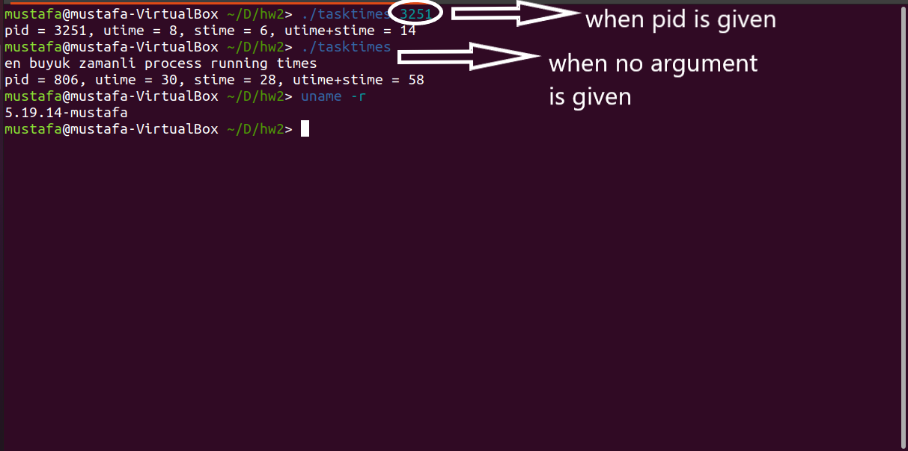

2022 Fall Semester Operating Systems Lecture Homework

> task_time_info system call is between lines 2732 and 2799 in sys.c.
>> its system call number is 451

# Task Time Info System Call

``task_time_info`` is system call that calculates the total time of the process that matches the given *pid* number. When no argument is given, it finds the duration of the process has **the biggest running time**. What is meant by **the biggest running time** here is to find the process that has the biggest sum of **utime** and **stime**.

> **utime :** is the time the process has been in user mode. In other words, it represent the CPU usage time of the process itself

> **stime :** is the time the process has been in kernel mode. It means that stime represents the time of operations performed by the system for the process.

But the sum of utime and stime gives us a result in **jiffies**.

> **jiffies :** holds the number of ticks that have occurred since the system booted

We use ``seconds = (jiffies / HZ)`` to convert **jiffies** to seconds.

> **HZ :** holds the tick rate, timer interrupt frequency

## Output

